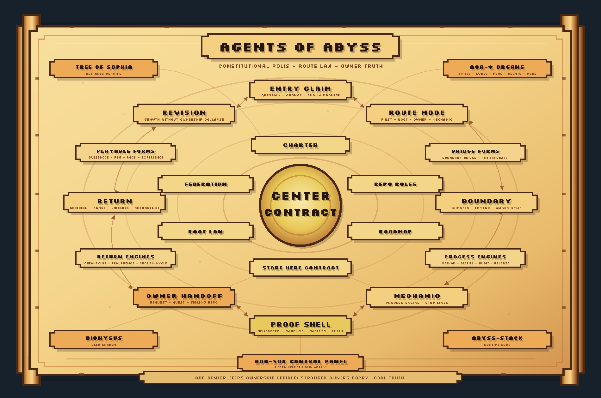

# Agents of Abyss (AoA)

`Agents-of-Abyss` is the constitutional polis of AoA: the place where the
federation is named, mapped, routed, and kept reviewable.

AoA itself is wider than this repository. It includes source-owned layers,
derived layers, routing surfaces, runtime bodies, public entry surfaces, and
adjacent system anchors. This center keeps their ownership legible without
absorbing their truth.

Use this README as the public front door. Use the linked owner surfaces when the
work becomes constitutional, directional, operational, mechanical, or
repository-local.

> Current release: `v0.2.3`. See [CHANGELOG](CHANGELOG.md) for release notes.

## What This Repository Does

| Function | Center surface |
|---|---|
| Names the AoA center and its authority boundary | [CHARTER](CHARTER.md) |
| Maps the current public federation contour | [ECOSYSTEM_MAP](ECOSYSTEM_MAP.md) |
| Keeps source, derived, routing, runtime, memory, proof, and authored meaning separate | [FEDERATION_RULES](docs/FEDERATION_RULES.md) |
| Routes work to the repository or mechanic that can carry it | [REPO_ROLES](docs/REPO_ROLES.md), [mechanics](mechanics/README.md) |
| Holds program-level direction without becoming a changelog or package roadmap | [ROADMAP](ROADMAP.md) |
| Supports public claims through evidence, generated capsules, and validation | [release support](mechanics/release-support/README.md) |

This repository is strongest when it clarifies ownership. It is weakest when it
tries to become every layer at once.

## Constitutional Cycle

## Start Here

Read only what matches your entry need.

| Need | Route |
|---|---|
| Shortest honest overview | this README, then [CHARTER](CHARTER.md), [ECOSYSTEM_MAP](ECOSYSTEM_MAP.md), and [FEDERATION_RULES](docs/FEDERATION_RULES.md) |
| Authority boundary | [CHARTER](CHARTER.md) |
| Current federation map | [ECOSYSTEM_MAP](ECOSYSTEM_MAP.md) |
| Program direction | [ROADMAP](ROADMAP.md) |
| Repository ownership routing | [REPO_ROLES](docs/REPO_ROLES.md) |
| Root file placement | [ROOT_SURFACE_LAW](docs/ROOT_SURFACE_LAW.md) |
| Center mechanics | [mechanics/README](mechanics/README.md) |
| Agent editing route | [AGENTS](AGENTS.md), then the nearest nested `AGENTS.md` |
| Compact machine route | [center_entry_map.min.json](generated/center_entry_map.min.json) |

The route vocabulary behind this entry surface is governed by
[START_HERE_ROUTE_CONTRACT](docs/START_HERE_ROUTE_CONTRACT.md).

## Route Modes

Every public entry surface exposes the same route-mode vocabulary.

| Route mode | Use when | Start surface |
|---|---|---|
| `first-reading` | you need the shortest honest center overview | `README.md` |
| `root-editing` | you will add, move, delete, rename, or rewrite a root surface | [ROOT_SURFACE_LAW](docs/ROOT_SURFACE_LAW.md) |
| `direction-change` | roadmap, horizon posture, maturity, owner-route pressure, future trigger, or release contour changes | [ROADMAP](ROADMAP.md) |
| `ownership-routing` | you need to decide which repository owns a change | [REPO_ROLES](docs/REPO_ROLES.md) |
| `mechanic-change` | you will touch a center mechanic package or its process route, stop-line, owner split, or validation lane | [mechanics/README](mechanics/README.md) |
| `public-claim-validation` | a sentence sounds like a public promise | [PUBLIC_SUPPORT_POSTURE](mechanics/release-support/docs/PUBLIC_SUPPORT_POSTURE.md) |
| `low-context-agent` | you need a compact machine-facing route before full reading | [center_entry_map.min.json](generated/center_entry_map.min.json) |
| `district-work` | you are already inside a technical district | nearest local `README.md` |

## Claim Check

Before trusting or publishing a center claim, route it through the smallest
surface that can answer it.

| Claim question | Check |
|---|---|
| May the center say this at all? | [CHARTER](CHARTER.md) |
| Is the named repository or anchor in the current public contour? | [ECOSYSTEM_MAP](ECOSYSTEM_MAP.md) and [ecosystem_registry.min.json](generated/ecosystem_registry.min.json) |
| Does the wording preserve owner truth boundaries? | [FEDERATION_RULES](docs/FEDERATION_RULES.md) and [REPO_ROLES](docs/REPO_ROLES.md) |
| Is this current direction rather than released history or mechanic-local planning? | [ROADMAP](ROADMAP.md) |
| Is this a public promise that needs release support? | [PUBLIC_SUPPORT_POSTURE](mechanics/release-support/docs/PUBLIC_SUPPORT_POSTURE.md) |
| Is this a mechanic process, stop-line, owner split, or validation route? | [mechanics/README](mechanics/README.md) and [mechanics/registry.json](mechanics/registry.json) |
| Does the machine route still match the human route? | [ENTRY_SURFACE_VALIDATION_BASELINE](docs/guardrails/ENTRY_SURFACE_VALIDATION_BASELINE.md) |

Use [release_check.py](scripts/release_check.py) for broad release-facing or
repo-wide validation. The baseline command set lives in
[ENTRY_SURFACE_VALIDATION_BASELINE](docs/guardrails/ENTRY_SURFACE_VALIDATION_BASELINE.md)
so this README can stay readable.

## Current Contour

The released center contour for `v0.2.3` is roadmap continuity and
owner-boundary hardening.

Current anchors:

- [CHARTER](CHARTER.md), [ECOSYSTEM_MAP](ECOSYSTEM_MAP.md), and
  [FEDERATION_RULES](docs/FEDERATION_RULES.md) for center law and source
  discipline
- [ROADMAP](ROADMAP.md) for center-wide direction and future triggers
- [mechanics](mechanics/README.md) for center mechanics and their local
  packages
- [generated capsules](generated/README.md) for compact machine companions
- [release support](mechanics/release-support/README.md) for public claims,
  state transitions, handoffs, rollback routes, and changelog/roadmap split

Detailed repository roles live in [ECOSYSTEM_MAP](ECOSYSTEM_MAP.md) and
[REPO_ROLES](docs/REPO_ROLES.md). Detailed mechanic futures live in
`mechanics/<slug>/ROADMAP.md`, not in this README.

## Center Mechanics

Center mechanics live under [mechanics/](mechanics/README.md). Each package has
its own `README.md`, `AGENTS.md`, `PARTS.md`, `ROADMAP.md`, `LANDING_LOG.md`,
owner requests, provenance, and validation route where needed.

Use the mechanics atlas when the question is what kind of move is happening:
method growth, recurrence, checkpoint, experience, agon, antifragility,
questbook, RPG, boundary bridge, audit, distillation, growth cycle, release
support, or another center mechanic registered in
[mechanics/registry.json](mechanics/registry.json).

## Technical Districts

Root-adjacent technical districts have local gates:

| District | Use for |
|---|---|
| [generated](generated/README.md) | compact derived capsules and freshness checks |
| [scripts](scripts/README.md) | validators, builders, and helper commands |
| [schemas](schemas/README.md) | machine contracts |
| [tests](tests/README.md) | regression surfaces |
| [config](config/README.md) | repo-local validator and builder config |
| [examples](examples/README.md) | compact examples that teach current contracts |
| [manifests](manifests/README.md) | repo-level manifest posture |
| [quests](quests/README.md) | public durable obligations |
| [Spark](Spark/README.md) | standalone fast-model work lanes |

District gates explain local handling. They do not replace center authority,
mechanic packages, or owner repositories.

## Machine Companions

Machine-facing surfaces summarize and validate the human route:

| Surface | Role |
|---|---|
| [center_entry_map.min.json](generated/center_entry_map.min.json) | compact entry route capsule |
| [ecosystem_registry.min.json](generated/ecosystem_registry.min.json) | current public federation contour |
| [federation_supporting_inventory.min.json](generated/federation_supporting_inventory.min.json) | supporting consumers outside registry v2 |
| [mechanic_card_index.min.json](generated/mechanic_card_index.min.json) | compact mechanic package cards |
| [agents_mesh.min.json](generated/agents_mesh.min.json) | AGENTS mesh coverage companion |

Generated surfaces are companions, not authority. Source docs and owner
surfaces keep meaning.

## Working Rule

Grow the polis by making the next route clearer.

Add law, maps, mechanics, generated capsules, examples, tests, and owner
requests only where they improve reviewability and preserve owner boundaries.
When a detail belongs to another repository, mechanic, district, roadmap,
landing log, changelog, quest, or decision record, route it there.
